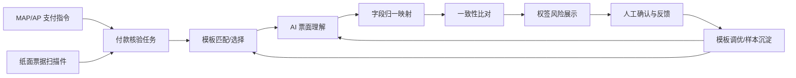

# Bill Verification

权签环节票据一致性 AI 预审方案与 Demo 仓库。

本项目用于验证一个面向权签场景的智能化能力：在支票、转账信、汇款申请书等付款文件移交银行前，使用 AI 对纸面票据信息与 MAP/AP 系统支付指令进行一致性预审，提前提示金额、币种、账号、收款方、银行等关键风险，辅助权签人更聚焦地完成最终审查。

## 项目定位

本项目不是自动审批系统，也不是替代权签人的最终判断。

当前定位是：

- AI 负责票面信息提取、字段归一和风险初筛。
- 系统展示 AI 识别值、系统值、差异说明、风险等级和票面证据。
- 权签人基于 AI 提示完成最终人工确认。
- 人工反馈沉淀为字段别名、模板规则和模型优化样本。

## 当前 Demo

当前 Demo 已实现四个产品页面：

- **付款核验**：选择付款任务，查看系统支付指令和票面文档，点击“开始 AI 预审”，真实调用多模态模型提取票面字段并执行核验。
- **模板调优**：按模板维护字段常见叫法、位置提示和 AI 识别要求。
- **反馈样本**：承接权签人的 AI 识别错误、忽略、确认不一致和提交优化等反馈。
- **系统设置**：配置 OpenAI-compatible 模型 URL、模型名、API Key，并支持文本和图片测试。

当前主流程已经不再只是静态展示。点击“开始 AI 预审”会调用模型提取票面字段，再进入规则核验。

## 文档入口

- [当前 Demo 实现说明](docs/current-demo-implementation.md)：当前页面结构、代码实现、样例、真实模型验证和限制。
- [产品方案](docs/bill-verification-product-solution.md)：业务背景、产品架构、字段归一、风险比对、配置闭环、产品职责划分和 MVP 范围。
- [Demo 技术方案](docs/demo-technical-solution.md)：模型调用、后端结构、配置、规则比对和实施步骤。
- [评审摘要](docs/review-summary.md)：适合会议沟通的短版摘要。
- [模板参考要点](docs/online-template-notes.md)：公开票据模板字段参考。

## 核心链路



## 本地启动

Windows 环境可使用：

```bat
start_demo.bat
```

该脚本会在项目内创建 `.venv`，并显式使用 `.venv\Scripts\python.exe` 安装 `requirements.txt` 中的依赖。

启动后访问：

```text
http://127.0.0.1:8000/
```

## 模型配置

模型配置在 Demo 页面 **系统设置** 中维护。

配置项：

- OpenAI-compatible URL。
- 模型名称。
- API Key。
- 超时时间。

配置会保存到本地 `config.local.json`，该文件已被 `.gitignore` 忽略，不会提交到 Git。

可参考 `.env.example`。当前已按火山方舟 OpenAI-compatible 接口和 `Doubao-Seed-2.0-pro` 完成端到端验证。

## 当前样例

当前包含三组合成样例：

- 国内支票：整体一致。
- 跨境电汇：金额不一致。
- 跨境电汇：收款账号不一致。

样例数据均为合成数据，不包含公司真实敏感信息。

