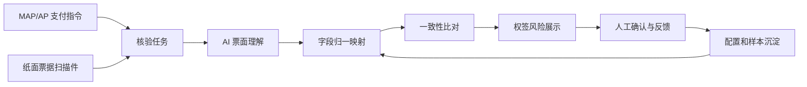

# Bill Verification

权签环节票据一致性 AI 预审方案与 Demo 仓库。

本项目用于梳理和验证一个面向权签场景的智能化能力：在支票、转账信、汇款申请书等付款文件移交银行前，使用 AI 对纸面票据信息与 MAP/AP 系统支付指令进行一致性预审，提前提示金额、币种、账号、收款方、银行等关键风险，辅助权签人更聚焦地完成最终审查。

## 项目定位

本项目不是自动审批系统，也不是替代权签人的最终判断。

当前定位是：

- AI 做票面信息提取、字段归一和风险初筛。
- 系统展示 AI 识别值、系统值、差异说明、风险等级和票面证据。
- 权签人基于 AI 提示完成最终人工确认。
- 人工反馈沉淀为后续字段别名、模板规则和模型优化样本。

## 文档入口

- [产品方案](docs/bill-verification-product-solution.md)：业务背景、产品架构、字段归一、风险比对、配置闭环、产品职责划分和 MVP 范围。
- [Demo 技术方案](docs/demo-technical-solution.md)：围绕公司内部多模态大模型接口的 Demo 架构、技术组件、模型调用策略和实施步骤。
- [评审摘要](docs/review-summary.md)：适合会议沟通的短版摘要。

## 核心链路

## Demo 方向

Demo 阶段建议先验证最小闭环：

1. 准备脱敏票据样例和对应 MAP/AP 系统 JSON。
2. 用静态 JSON 跑通权签风险展示页面。
3. 接入公司内部多模态大模型接口，验证票面字段提取效果。
4. 用规则代码完成金额、币种、账号、名称、日期等核心字段比对。
5. 增加人工反馈记录，为后续配置化优化做准备。

推荐技术栈：

- 前端：React + Vite + TypeScript。
- 后端：Python FastAPI。
- 存储：本地文件或 SQLite。
- 模型：公司内部多模态大模型接口，暂按 Qwen3.5 35B A3B 类接口设计。

## 当前阶段

当前仓库处于方案设计和 Demo 准备阶段。下一步重点是确认内部模型接口协议、准备脱敏样例，并搭建静态 Demo 骨架。
