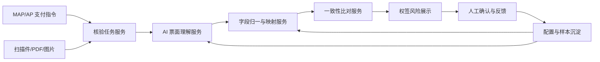

# 权签票据一致性 AI 预审产品方案

## 1. 背景

在支票、转账信、汇款申请书等付款文件移交银行前，权签人需要核对纸面文件与 MAP/AP 系统支付指令是否一致。当前主要依赖人工肉眼核对，历史上的“所见即所得”工具只能把系统指令按模板展示出来，仍然需要权签人逐项比对纸面文件。

随着采购合同与验收文档一致性验证等 AI 能力的落地，权签场景也希望引入 AI，对纸面票据信息和系统结构化数据做一轮风险初筛，帮助权签人聚焦高风险差异。

本方案的定位是：建设一个面向权签环节的票据一致性 AI 预审能力，通过票面理解、字段归一、风险比对和人工反馈闭环，辅助权签人发现潜在不一致风险。

## 2. 目标与非目标

### 2.1 目标

- 对纸面支票、转账信、汇款申请书等付款文件进行 OCR 和结构化解析。
- 将不同国家、不同银行、不同模板上的票面字段归一到 MAP/AP 标准支付字段。
- 对系统支付指令和票面识别结果进行一致性比对。
- 输出风险等级、差异说明、票面证据位置和 AI 置信度。
- 支持权签人或运营人员对 AI 结果进行纠正和反馈。
- 通过字段别名、模板规则和反馈样本实现持续优化，减少每次优化都依赖产品发版。

### 2.2 非目标

- 第一阶段不替代权签人的最终责任。
- 第一阶段不做自动放行或自动拒绝。
- 第一阶段不追求覆盖全球所有银行模板。
- 第一阶段不要求业务提前穷举所有票据字段和模板差异。
- 第一阶段不把 AI 结果作为唯一审查依据，而是作为风险提示和审查补充。

## 3. 业务流程

1. 作业人员在 MAP/AP 系统中生成或维护支付指令。
2. 出纳将支付指令写入纸面票据或通过票打工具打印到付款文件。
3. 作业人员扫描或上传纸面付款文件。
4. MAP/AP 将系统结构化支付指令和票据文件传递给 AI 产品。
5. AI 产品完成票面解析、字段归一和风险比对。
6. MAP/AP 权签页面展示 AI 预审结果。
7. 权签人查看系统值、票面值、差异说明和票面证据位置。
8. 权签人作出人工判断：确认一致、确认不一致、AI 识别错误、忽略提示或提交优化。
9. 系统沉淀人工反馈，进入后续模板、别名、规则和模型优化。

## 4. 总体产品架构

核心分层：

- MAP/AP：提供系统支付事实、权签流程、业务比对口径和结果展示入口。
- AI 产品：负责票面理解、字段提取、字段归一、证据定位和置信度输出。
- 共享规则资产：维护核验字段 Schema、字段别名、模板规则、风险规则和反馈样本。

## 5. 核心能力设计

### 5.1 票面理解

票面理解负责从图片、PDF 或扫描件中提取可用于核验的原始信息。

能力包括：

- OCR 文字识别。
- 版面区域识别。
- 表格、印章、手写、打印文本的识别。
- 多语言字段理解。
- 文档类型识别，例如支票、转账信、汇款申请书。
- 银行、国家、模板类型的初步判断。
- 字段候选值和原文坐标输出。

输出不应只是一组字段值，还应包含：

- 原文文本。
- 字段候选来源。
- 坐标或页码区域。
- 置信度。
- 识别依据说明。

### 5.2 字段归一

字段归一是本方案最关键的产品能力。它负责把不同票面表述映射到 MAP/AP 的标准字段。

建议采用三类归一方式：

1. 语义字段归一  
   适用于有明确字段名或上下文的场景，例如 Beneficiary Bank、Payee、Amount、Currency。

2. 模板区域归一  
   适用于版式稳定的银行模板，通过固定区域、相对位置或版面规则定位字段。

3. 候选值反向匹配  
   适用于无明确 key 的场景。例如票面只出现“中国工商银行”，但没有写“付款方银行”。此时可以结合系统候选值、票面位置、模板历史和上下文判断它对应的标准字段。

字段归一输出应保留多候选，而不是只输出一个答案：

| 标准字段 | 票面候选值 | 置信度 | 来源区域 | 归一依据 |
|---|---|---:|---|---|
| 收款方银行 | ABC Bank Hong Kong | 0.92 | 第 1 页中部 | 字段别名 + 上下文 |
| 付款方银行 | 中国工商银行 | 0.78 | 页眉 | 系统候选值匹配 + 模板规则 |

### 5.3 一致性比对

比对服务基于 MAP/AP 系统值和 AI 归一字段进行核验。

核心比对字段：

- 付款方名称。
- 付款方账号。
- 付款方银行。
- 收款方名称。
- 收款方账号。
- 收款方银行。
- 金额数字。
- 金额大写。
- 币种。
- 付款日期。
- 汇款用途或摘要。
- 银行代码、SWIFT、IBAN、中间行等跨境付款字段。
- 不可转让、只入收款人账户等票面风险字段。

比对类型：

- 精确一致：账号、币种、金额数字等。
- 归一后一致：银行名称、公司名称、大小写、空格、标点、繁简体差异等。
- 语义一致：汇款用途、摘要、地址等。
- 风险提示：票面出现系统无对应字段的信息，例如 Not Negotiable、A/C Payee Only。
- 缺失提示：系统有字段但票面未识别到，或票面关键区域无法读取。

### 5.4 风险分层

建议不要用简单的“通过/不通过”，而是用风险等级：

| 等级 | 含义 | 示例 | 权签动作 |
|---|---|---|---|
| 高风险 | 可能影响付款对象、金额或银行处理 | 金额不一致、账号不一致、币种不一致、收款人不一致 | 必须人工重点确认 |
| 中风险 | 可能影响处理但需要结合上下文判断 | 银行名称近似、日期格式差异、用途不完全一致 | 建议人工确认 |
| 低风险 | 信息不完整或辅助提示 | 识别置信度低、特殊票面条款 | 展示提示 |
| 无风险 | 系统值与票面值一致 | 金额、币种、账号一致 | 可折叠展示 |

## 6. 指标体系

本场景不建议只用单一准确率评估。建议按字段风险分层评估。

### 6.1 核心指标

- 高风险字段召回率：金额、币种、账号、收款人等关键不一致是否能被提示。
- 高风险字段误报率：关键字段频繁误报会影响权签体验。
- 字段提取准确率：票面字段是否提取正确。
- 字段归一准确率：票面字段是否映射到正确系统字段。
- 比对判断准确率：一致/不一致判断是否正确。
- 人工处理效率：权签人平均核对耗时是否下降。
- 反馈有效率：人工纠正是否能转化为后续优化。

### 6.2 指标取向

对金额、币种、账号、收款人等核心支付字段，优先保证召回率，宁可多提示一些风险。

对低风险字段和辅助提示，优先控制误报，避免对兼职权签人造成过多干扰。

因此整体策略是：高风险字段重召回，低风险提示重精确率。

## 7. 配置与反馈闭环

### 7.1 配置资产

建议配置资产分为四层：

1. 标准字段 Schema  
   由 MAP/AP 和业务共同定义，明确系统标准字段、风险等级、比对方式和展示方式。

2. 字段别名库  
   管理不同语言、不同银行、不同模板对同一字段的叫法。

3. 模板规则库  
   管理银行、国家、文档类型、字段区域、固定位置、特殊字段和字段优先级。

4. 反馈样本库  
   沉淀 AI 识别结果、人工修正、最终结论、原始票面和证据区域。

### 7.2 人工反馈动作

权签人侧建议保持简单：

- 确认一致。
- 确认不一致。
- AI 识别错误。
- 忽略该提示。
- 提交优化样本。

运营或配置人员侧可以更细：

- 修正字段值。
- 修正字段归属。
- 新增字段别名。
- 新增模板区域规则。
- 标记无需关注字段。
- 标记特殊风险字段。

### 7.3 无发版优化

为了避免每次新增模板或字段别名都走两个月发版周期，建议把以下内容产品化配置：

- 字段别名。
- 字段风险等级。
- 是否参与比对。
- 比对规则类型。
- 模板识别条件。
- 字段区域规则。
- 特殊票面字段提示规则。

涉及系统字段新增、权签流程变化、接口结构变化的内容，仍然需要 MAP/AP 或 AI 产品发版。

## 8. 产品职责划分

### 8.1 MAP/AP 产品职责

- 提供系统支付指令标准字段。
- 定义权签流程中的 AI 结果展示和人工操作。
- 定义业务核验口径，例如哪些字段必须一致、哪些字段允许模糊匹配。
- 保存权签人的最终判断和审查记录。
- 与 AI 产品对接核验任务和核验结果。

### 8.2 AI 产品职责

- 接收票据文件并完成 OCR、版面分析和字段提取。
- 进行票面字段到标准字段的归一映射。
- 输出字段值、候选值、置信度和票面证据位置。
- 维护字段别名库、模板规则库和样本反馈能力。
- 提供 AI 预审结果接口。

### 8.3 双方共管内容

- 核验字段 Schema。
- 字段风险等级。
- 比对规则标准。
- 反馈闭环机制。
- 试点范围和验收指标。

## 9. MVP 建议

第一阶段建议目标是验证闭环，而不是覆盖全部场景。

### 9.1 试点范围

- 选择 5-10 个高频国家或地区。
- 选择 20-30 个高频银行模板。
- 优先覆盖实际业务量，而不是模板数量。
- 优先覆盖转账信和汇款申请书，再扩展到支票等更复杂手写场景。

### 9.2 MVP 字段

- 付款方名称。
- 付款方账号。
- 付款方银行。
- 收款方名称。
- 收款方账号。
- 收款方银行。
- 金额。
- 币种。
- 付款日期。
- 汇款用途。
- 不可转让或限定支付类字段。

### 9.3 MVP 页面能力

- 展示系统值、票面值和一致性结果。
- 展示风险等级和差异说明。
- 支持点击查看票面证据位置。
- 支持权签人确认和反馈。
- 支持运营人员查看样本和修正规则。

### 9.4 MVP 验收建议

- 高风险字段差异召回率达到可试点水平。
- 核心字段误报率不明显影响权签效率。
- 权签人能理解 AI 提示依据。
- 至少能通过反馈样本优化一批模板或字段别名。
- 形成 MAP/AP 与 AI 产品的接口和职责边界。

## 10. 后续演进

后续可以按以下路径演进：

1. 从高频模板扩展到长尾模板。
2. 从打印件扩展到手写和低质量扫描件。
3. 从字段一致性扩展到票面完整性、章印、签字、格式风险。
4. 从人工配置扩展到基于反馈样本的自动规则推荐。
5. 从单票据核验扩展到付款附件、合同、验收单、发票等多文档一致性。

