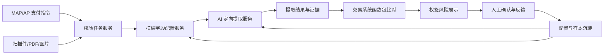

# 权签票据一致性 AI 预审产品方案

## 1. 背景

在支票、转账信、汇款申请书等付款文件移交银行前，权签人需要核对纸面文件与 MAP/AP 系统支付指令是否一致。当前主要依赖人工肉眼核对，历史上的“所见即所得”工具只能把系统指令按模板展示出来，仍然需要权签人逐项比对纸面文件。

随着采购合同与验收文档一致性验证等 AI 能力的落地，权签场景也希望引入 AI，对纸面票据信息和系统结构化数据做一轮风险初筛，帮助权签人聚焦高风险差异。

本方案的最新定位是：建设一个“基于模板字段配置”的票据一致性 AI 预审能力。业务先在模板上配置本次要核验的字段集合、系统来源、字段含义、票面别名和提取提示；AI 只在该明确范围内做定向提取；最终比对规则由交易系统/MAP 函数包实施和预览，权签人仍负责最终判断。

## 2. 目标与非目标

### 2.1 目标

- 对纸面支票、转账信、汇款申请书等付款文件进行定向字段提取。
- 支持业务按模板配置要提取的字段、系统来源、业务含义、票面别名、位置提示和提取要求。
- 只有模板配置完成并发布后，正式权签流程才启动 AI。
- 将 AI 提取结果交给交易系统/MAP 的函数包进行一致性比对。
- 输出风险等级、差异说明、票面证据位置和 AI 置信度。
- 支持权签人或运营人员对 AI 结果进行纠正和反馈。
- 通过字段别名、模板规则和反馈样本实现持续优化，减少每次优化都依赖产品发版。

### 2.2 非目标

- 第一阶段不替代权签人的最终责任。
- 第一阶段不做自动放行或自动拒绝。
- 第一阶段不追求覆盖全球所有银行模板。
- 第一阶段不要求 AI 自动理解全球所有票据字段；AI 仅处理业务已配置字段。
- 第一阶段不把 AI 结果作为唯一审查依据，而是作为风险提示和审查补充。

## 3. 业务流程

1. 作业人员在 MAP/AP 系统中生成或维护支付指令。
2. 出纳将支付指令写入纸面票据或通过票打工具打印到付款文件。
3. 作业人员扫描或上传纸面付款文件。
4. MAP/AP 根据当前模板判断是否存在已发布 AI 字段配置。
5. 若模板未配置、未启用或未发布，AI 不启动；若已配置，则将票据文件、系统指令和字段配置传递给 AI 产品。
6. AI 产品按配置字段定向提取票面值、原文证据和置信度。
7. 交易系统/MAP 调用函数包完成日期、金额、账号、名称等比对规则。
8. MAP/AP 权签页面展示 AI 预审结果。
7. 权签人查看系统值、票面值、差异说明和票面证据位置。
8. 权签人作出人工判断：确认一致、确认不一致、AI 识别错误、忽略提示或提交优化。
9. 系统沉淀人工反馈，进入后续模板、别名、规则和模型优化。

## 4. 总体产品架构

核心分层：

- MAP/AP/交易系统：提供系统支付事实、权签流程、比对函数包、结果展示入口和发布管控。
- AI 产品：负责按模板字段配置进行票面定向提取、证据定位和置信度输出。
- 模板配置资产：维护字段清单、系统来源、字段含义、票面别名、位置提示、提取要求和反馈样本。

## 5. 核心能力设计

### 5.1 票面理解与原文抽取

票面理解负责从图片、PDF 或扫描件中提取当前模板已配置字段的原始信息。它不是开放式抽取所有票面字段，而是在业务给定字段集合内找值。

能力包括：

- OCR 文字识别。
- 版面区域识别。
- 表格、印章、手写、打印文本的识别。
- 多语言字段理解。
- 字段候选值和原文证据输出。

输出不应直接只给“系统字段值”，而应先保留票面原文：

- `document_items`：票面原始 Key/Value，例如 `入账行：中国工商银行上海分行`。
- 原文证据：页码、区域、原文片段。
- 不确定项也应保留原始 Key/Value，不要强行映射。

在此基础上，再输出 `extracted_fields`，表示该字段属于当前模板配置中的哪一个 `field_id`。未配置字段不应进入正式提取结果。

### 5.2 模板字段配置

模板字段配置是本方案最关键的产品能力。它把原先由 AI 自行判断的“该提什么、字段是什么意思、票面可能叫什么”前移到业务配置环节。

每个模板字段建议配置：

- 字段是否参与本模板 AI 提取。
- 对应系统来源字段。
- 展示名称。
- 业务含义。
- 票面别名。
- 位置提示。
- AI 提取要求。
- 沙箱测试样例和测试结果。

Demo 中对应配置文件为 `config/template_ai_fields.json`。生产环境中建议迁移到 MAP/交易系统配置中心，并纳入权限、版本、发布和回滚管理。

模板状态建议分为：

- 草稿：仅可编辑，不进入正式流程。
- 沙箱：可上传样例测试模型提取效果。
- 已发布：正式权签流程可调用 AI。
- 停用：正式流程不调用 AI。

### 5.3 配置沙箱

配置沙箱用于降低“业务配置提示词过于复杂导致模型无法理解”的风险。

沙箱流程：

1. 业务选择模板并维护字段配置。
2. 上传一张或多张测试票据。
3. 系统按当前配置组装 prompt 并调用模型。
4. 页面展示每个字段的提取值、票面证据、置信度和未提取字段。
5. 业务调整别名、含义、位置或提取要求。
6. 多轮测试通过后发布配置。

### 5.4 比对规则函数包

产品后续的最终比对规则交由交易系统/MAP 实施。常见函数包包括：

| 函数包 | 作用 | 示例 |
|---|---|---|
| 日期归一 | 将不同票面日期格式转换为统一日期口径 | `2026年5月6日` vs `2026-05-06` |
| 金额归一 | 处理千分位、小数位、币种符号 | `128,500.00` vs `128500.00` |
| 金额大小写转换 | 比对数字金额和大写金额 | `壹拾贰万捌仟伍佰元整` |
| 账号归一 | 去除空格、短横线等格式差异 | `6222-0099` vs `62220099` |
| 名称归一 | 处理大小写、标点、公司后缀差异 | `Co., Ltd.` vs `Company Limited` |
| 银行名称归一 | 处理中英文名、简称、分支行表达 | `ICBC Shanghai Branch` |

AI 产品不负责最终业务判断，只输出票面提取值、原文证据和置信度。交易系统负责调用函数包、展示比对结果并提供业务预览。

建议输出结构如下：

| 票面 Key | 票面 Value | 映射字段 | 映射来源 | 置信度 |
|---|---|---|---|---:|
| 入账行 | 中国工商银行上海分行 | beneficiary_bank | 字段别名 | 0.86 |
| Account With Institution | HSBC London Branch | beneficiary_bank | 模型语义 + 模板规则 | 0.91 |

字段归一输出应保留多候选，而不是只输出一个答案：

| 标准字段 | 票面候选值 | 置信度 | 来源区域 | 归一依据 |
|---|---|---:|---|---|
| 收款方银行 | ABC Bank Hong Kong | 0.92 | 第 1 页中部 | 字段别名 + 上下文 |
| 付款方银行 | 中国工商银行 | 0.78 | 页眉 | 系统候选值匹配 + 模板规则 |

### 5.3 一致性比对

比对服务基于 MAP/AP 系统值和 AI 归一字段进行核验。

核心比对字段：

- 付款方名称。
- 付款方账号。
- 付款方银行。
- 收款方名称。
- 收款方账号。
- 收款方银行。
- 金额数字。
- 金额大写。
- 币种。
- 付款日期。
- 汇款用途或摘要。
- 银行代码、SWIFT、IBAN、中间行等跨境付款字段。
- 不可转让、只入收款人账户等票面风险字段。

比对类型：

- 精确一致：账号、币种、金额数字等。
- 归一后一致：银行名称、公司名称、大小写、空格、标点、繁简体差异等。
- 语义一致：汇款用途、摘要、地址等。
- 风险提示：票面出现系统无对应字段的信息，例如 Not Negotiable、A/C Payee Only。
- 缺失提示：系统有字段但票面未识别到，或票面关键区域无法读取。

### 5.4 风险分层

建议不要用简单的“通过/不通过”，而是用风险等级：

| 等级 | 含义 | 示例 | 权签动作 |
|---|---|---|---|
| 高风险 | 可能影响付款对象、金额或银行处理 | 金额不一致、账号不一致、币种不一致、收款人不一致 | 必须人工重点确认 |
| 中风险 | 可能影响处理但需要结合上下文判断 | 银行名称近似、日期格式差异、用途不完全一致 | 建议人工确认 |
| 低风险 | 信息不完整或辅助提示 | 识别置信度低、特殊票面条款 | 展示提示 |
| 无风险 | 系统值与票面值一致 | 金额、币种、账号一致 | 可折叠展示 |

## 6. 指标体系

本场景不建议只用单一准确率评估。建议按字段风险分层评估。

### 6.1 核心指标

- 高风险字段召回率：金额、币种、账号、收款人等关键不一致是否能被提示。
- 高风险字段误报率：关键字段频繁误报会影响权签体验。
- 字段提取准确率：票面字段是否提取正确。
- 字段归一准确率：票面字段是否映射到正确系统字段。
- 比对判断准确率：一致/不一致判断是否正确。
- 人工处理效率：权签人平均核对耗时是否下降。
- 反馈有效率：人工纠正是否能转化为后续优化。

### 6.2 指标取向

对金额、币种、账号、收款人等核心支付字段，优先保证召回率，宁可多提示一些风险。

对低风险字段和辅助提示，优先控制误报，避免对兼职权签人造成过多干扰。

因此整体策略是：高风险字段重召回，低风险提示重精确率。

## 7. 配置与反馈闭环

### 7.1 配置资产

建议配置资产分为四层：

1. 标准字段 Schema  
   由 MAP/AP 和业务共同定义，明确系统标准字段、风险等级、比对方式和展示方式。

2. 字段别名库  
   管理不同语言、不同银行、不同模板对同一字段的叫法，并明确匹配方式，避免“出款方账号”被无限扩展成更多未确认表达。

3. 模板规则库  
   管理银行、国家、文档类型、字段区域、固定位置、特殊字段和字段优先级。

4. 反馈样本库  
   沉淀 AI 识别结果、人工修正、最终结论、原始票面和证据区域。

### 7.2 人工反馈动作

权签人侧建议保持简单：

- 确认一致。
- 确认不一致。
- AI 识别错误。
- 忽略该提示。
- 提交优化样本。

运营或配置人员侧可以更细：

- 修正字段值。
- 修正字段归属。
- 新增字段别名。
- 新增模板区域规则。
- 标记无需关注字段。
- 标记特殊风险字段。

### 7.3 无发版优化

为了避免每次新增模板或字段别名都走两个月发版周期，建议把以下内容产品化配置：

- 字段别名。
- 字段风险等级。
- 是否参与比对。
- 比对规则类型。
- 模板识别条件。
- 字段区域规则。
- 特殊票面字段提示规则。
- 配置生效范围，例如全局、国家、银行、模板或单一字段。
- 别名匹配方式，例如精确匹配、包含匹配、模糊匹配。

涉及系统字段新增、权签流程变化、接口结构变化的内容，仍然需要 MAP/AP 或 AI 产品发版。

### 7.4 配置与 Prompt 的关系

建议不要把配置简单堆进 prompt 让模型自由联想。更稳妥的组合是：

1. 模型先抽取票面原始 Key/Value，尽量不改写。
2. 后端用别名表、模板规则、字段 Schema 做确定性映射。
3. Prompt 只注入当前模板必要的少量提示，例如“本模板中入账行表示收款方银行”。
4. 映射结果保留来源：AI 语义、别名、模板规则、人工反馈。

这样既利用模型的视觉和语言能力，也避免配置扩张带来不可控泛化。

## 8. 产品职责划分

### 8.1 MAP/AP 产品职责

- 提供系统支付指令标准字段。
- 定义权签流程中的 AI 结果展示和人工操作。
- 定义业务核验口径，例如哪些字段必须一致、哪些字段允许模糊匹配。
- 保存权签人的最终判断和审查记录。
- 与 AI 产品对接核验任务和核验结果。

### 8.2 AI 产品职责

- 接收票据文件并完成 OCR、版面分析和字段提取。
- 进行票面字段到标准字段的归一映射。
- 输出字段值、候选值、置信度和票面证据位置。
- 维护字段别名库、模板规则库和样本反馈能力。
- 提供 AI 预审结果接口。

### 8.3 双方共管内容

- 核验字段 Schema。
- 字段风险等级。
- 比对规则标准。
- 反馈闭环机制。
- 试点范围和验收指标。

## 9. MVP 建议

第一阶段建议目标是验证闭环，而不是覆盖全部场景。

当前 Demo 已按该思路实现了一个轻量 MVP：通过合成票据样例、模拟 MAP/AP 支付指令、真实多模态模型提取、规则核验、风险展示、反馈记录和模板调优页面，验证端到端产品旅程。最新版本还增加了可编辑 Word 测试用例，便于业务自行改字段、截图构造更多配置验证样本。

### 9.1 试点范围

- 选择 5-10 个高频国家或地区。
- 选择 20-30 个高频银行模板。
- 优先覆盖实际业务量，而不是模板数量。
- 优先覆盖转账信和汇款申请书，再扩展到支票等更复杂手写场景。

### 9.2 MVP 字段

- 付款方名称。
- 付款方账号。
- 付款方银行。
- 收款方名称。
- 收款方账号。
- 收款方银行。
- 金额。
- 币种。
- 付款日期。
- 汇款用途。
- 不可转让或限定支付类字段。

### 9.3 MVP 页面能力

- 展示系统值、票面值和一致性结果。
- 展示风险等级和差异说明。
- 支持点击查看票面证据位置。
- 支持权签人确认和反馈。
- 支持运营人员查看样本和修正规则。

当前 Demo 页面进一步拆分为：

- 付款核验：权签人主流程。
- 模板调优：维护字段别名、位置提示和 AI 识别要求。
- 反馈样本：承接人工反馈和后续优化。
- 系统设置：维护模型连接信息。

### 9.4 MVP 验收建议

- 高风险字段差异召回率达到可试点水平。
- 核心字段误报率不明显影响权签效率。
- 权签人能理解 AI 提示依据。
- 至少能通过反馈样本优化一批模板或字段别名。
- 形成 MAP/AP 与 AI 产品的接口和职责边界。

## 10. 后续演进

后续可以按以下路径演进：

1. 从高频模板扩展到长尾模板。
2. 从打印件扩展到手写和低质量扫描件。
3. 从字段一致性扩展到票面完整性、章印、签字、格式风险。
4. 从人工配置扩展到基于反馈样本的自动规则推荐。
5. 从单票据核验扩展到付款附件、合同、验收单、发票等多文档一致性。
