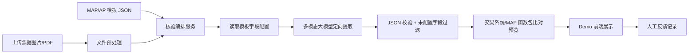

# 权签票据一致性 AI 预审 Demo 技术方案

## 1. Demo 目标

Demo 的目标不是一次性建设完整生产系统，而是围绕公司内部可访问的多模态大模型接口，快速验证以下问题：

- 大模型能否从真实或模拟票据中提取关键字段。
- 大模型能否先给出票面原始 Key/Value，再配合规则资产映射到 MAP/AP 标准字段。
- 系统值与票面值的差异能否被清晰展示。
- 权签人是否能基于 AI 结果更快定位风险。
- 人工反馈能否被沉淀为下一次优化的配置或样本。

当前 Demo 已按 OpenAI-compatible 接口接入多模态模型，并使用火山方舟 `Doubao-Seed-2.0-pro` 完成端到端验证。后续如果切换为公司内部其他模型，需要重新确认模型名称、上下文长度、图片输入格式、并发限制和输出稳定性。

### 1.1 最新方案修正：模板字段配置驱动

当前主方案已从“AI 开放式理解票据并自行决定字段映射”调整为“业务按模板配置字段集合，AI 在明确集合内定向提取”。

正式 AI 调用输入包括：

- 票据图片。
- 当前模板 ID。
- 该模板是否启用 AI、是否已发布。
- 本次需要提取的字段集合。
- 每个字段对应的系统来源字段。
- 票面可能别名。
- AI 识别说明：字段含义、常见位置和提取注意事项的合并说明。

正式 AI 输出不再是开放式字段集合，而是当前模板配置字段范围内的 `document_items`、`extracted_fields` 和 `special_risks`。如果模板没有配置、未启用或未发布，正式 AI 预审不启动。

日期转换、金额大小写转换、账号归一、银行名称归一、币种转换等最终比对规则后续由交易系统/MAP 函数包负责。Demo 后端当前只保留本地比对预览，用于展示端到端效果。

## 2. Demo 范围

### 2.1 输入

- 一张或多张票据图片。
- 可选 PDF，Demo 阶段可以先转图片后处理。
- 一份模拟 MAP/AP 系统支付指令 JSON。
- 一份当前模板的 AI 字段配置，包括字段集合、系统来源、票面别名和 AI 识别说明。

示例系统指令：

```json
{
  "payment_id": "PAY-2026-0001",
  "payer_name": "Example Trading Co., Ltd.",
  "payer_account": "123456789012",
  "payer_bank": "Industrial and Commercial Bank of China",
  "beneficiary_name": "Global Supplier Limited",
  "beneficiary_account": "987654321000",
  "beneficiary_bank": "ABC Bank Hong Kong",
  "currency": "USD",
  "amount": "12500.00",
  "payment_date": "2026-05-06",
  "purpose": "Invoice payment"
}
```

### 2.2 输出

- 票面原始 Key/Value，即 `document_items`。
- 当前模板字段集合内的定向提取结果，即 `extracted_fields`。
- 系统值与票面值对比表。
- 风险等级。
- 差异说明。
- 票面证据位置，如页码、区域、原文片段。
- 人工反馈入口。

## 3. Demo 架构



## 4. 推荐技术组件

### 4.1 前端

当前实现使用轻量 Web Demo：

- 原生 HTML/CSS/JavaScript。
- 由 FastAPI 直接托管静态页面。
- 图片预览通过浏览器 iframe 完成。
- 页面按付款核验、模板调优、反馈样本、系统设置四个标签组织。
- 付款核验页先选择模板并展示本模板待检查字段，再执行 AI 逐字段提取和风险核验。
- 模板调优页支持模板新增、复制、删除，以及模板字段增删改。

后续如果要产品化，可以迁移到 React + Vite + TypeScript。

页面建议包括：

- 左侧：票据图片预览。
- 右侧上方：系统支付指令。
- 右侧中部：AI 提取字段。
- 右侧下方：一致性风险列表。
- 支持点击风险项后在票据图片上高亮证据区域。

### 4.2 后端

建议使用 Python FastAPI，原因是：

- 适合快速封装 AI 接口。
- 方便处理图片、PDF、JSON Schema 校验。
- 方便后续接入 OCR、向量检索、规则引擎。

后端模块：

- 文件上传接口。
- PDF 转图片接口。
- 多模态模型调用封装。
- 模板字段配置管理，包括模板复制和字段增删改。
- Prompt 组装服务。
- JSON 结果解析和校验。
- 定向字段提取结果校验服务。
- 比对预览服务；生产中由交易系统/MAP 函数包负责。
- 反馈记录服务。

后端环境建议参考同类项目 `contract_handle` 的做法，使用项目内 `.venv` 管理依赖：

- `.venv/` 只保存在本地，不提交到 Git。
- 后端依赖写入仓库根目录 `requirements.txt`。
- Windows 环境使用 `start_demo.bat` 创建虚拟环境、安装依赖并启动服务。
- 安装依赖时显式使用 `.venv\Scripts\python.exe -m pip install -r requirements.txt`，避免依赖进入全局 Python 环境。

### 4.3 数据存储

Demo 阶段可以先用本地文件或 SQLite：

- `samples/`：样例票据图片。
- `data/payment_instructions/`：模拟系统支付指令。
- `data/results/`：AI 提取结果。
- `data/feedback/`：人工反馈。
- `config/template_ai_fields.json`：模板级 AI 字段配置，决定模板是否启用 AI、发布状态、字段集合、票面别名和 AI 识别说明。
- `config/field_schema.json`：字段展示、风险等级和 Demo 比对预览配置。
- `config/field_aliases.json`：旧版全局字段别名，当前保留用于兜底兼容。
- `config/mapping_rules.json`：比对归属和旧版模板提示配置。

如果后续接近生产，可替换为数据库和配置中心。

## 5. 多模态大模型调用策略

### 5.0 当前推荐策略：模板配置驱动的单次定向提取

当前推荐不要让模型开放式完成“识别所有字段、理解含义、映射系统字段、判断风险”的全链路任务，而是由模板配置决定本次要提取的字段集合：

```text
票据图片
+ 当前模板
+ 已配置字段清单
+ 字段系统来源、票面别名、AI 识别说明
→ 多模态模型定向提取
→ 输出 document_items / extracted_fields / special_risks
→ 后端按当前模板别名补充 mapped_field / extracted_fields
→ 交易系统/MAP 函数包核验
```

这使模型任务从“全局理解票据”收窄为“在业务指定字段范围内找值”，更适合上线。

当前实现中，字段别名不是只拼进 Prompt。后端会在模型返回后再次读取当前模板配置，对 `document_items.raw_key` 做确定性补映射：

- 如果 raw key 命中当前模板字段别名，则补充 `mapped_field`、`mapped_display_name`、`source_system_field`、`mapping_source=template_alias_rule`。
- 如果模型没有返回对应的 `extracted_fields`，但 `document_items` 已经命中别名，后端会补出一条结构化字段，供后续规则核验使用。
- “AI 识别说明”主要进入 Prompt，不直接作为宽泛匹配规则，避免自然语言描述被过度泛化。

### 5.0.1 配置沙箱

模板字段配置应支持沙箱验证：

1. 业务配置字段集合、票面别名和 AI 识别说明。
2. 上传样例票据。
3. 在沙箱中调用模型提取。
4. 查看提取值、证据、置信度和缺失字段。
5. 调整配置后再次测试。
6. 通过后发布，正式付款核验才启用 AI。

### 5.0.2 比对规则归属

日期转换、金额大小写转换、账号归一、银行名称归一、币种转换等最终比对规则建议由交易系统/MAP 以函数包方式实现。业务可在交易系统中配置函数包并预览结果。AI 产品只负责提供票面提取值、原文证据和置信度。

### 5.1 两阶段调用

建议不要一次性让模型完成所有事情。Demo 可以采用两阶段：

1. 票面原文结构化提取  
   输入票据图片，让模型输出原始 Key/Value、原文片段、位置描述和置信度。模型不得改写、补全或翻译票面文字。

2. 字段映射与风险判断  
   输入第一步结果 + 字段 Schema + 别名库 + 模板规则，由系统规则做确定性映射，必要时让模型辅助候选排序和解释差异。

其中最终一致性判断建议由规则代码完成，模型主要负责视觉理解和候选提取。这样结果更可控。

### 5.2 模型输出格式

要求模型严格输出 JSON，后端使用 JSON Schema 校验。

示例输出：

```json
{
  "document_type": "remittance_application",
  "language": ["en", "zh"],
  "document_items": [
    {
      "raw_key": "Account With Institution",
      "raw_value": "HSBC London Branch",
      "mapped_field": "beneficiary_bank",
      "mapped_display_name": "收款方银行",
      "source_system_field": "MAP付款指令.收款方银行",
      "mapping_source": "template_alias_rule",
      "mapping_confidence": 0.8,
      "evidence": {
        "page": 1,
        "text": "Account With Institution: HSBC London Branch",
        "region_hint": "beneficiary bank section"
      }
    }
  ],
  "extracted_fields": [
    {
      "raw_label": "Beneficiary",
      "raw_value": "Global Supplier Limited",
      "normalized_field": "beneficiary_name",
      "display_name": "收款方名称",
      "source_system_field": "MAP付款指令.收款方名称",
      "mapping_source": "ai",
      "confidence": 0.93,
      "evidence": {
        "page": 1,
        "text": "Beneficiary: Global Supplier Limited",
        "region_hint": "middle-left"
      }
    }
  ],
  "special_risks": [
    {
      "type": "non_transferable",
      "text": "A/C Payee Only",
      "confidence": 0.88,
      "evidence": {
        "page": 1,
        "region_hint": "top-right"
      }
    }
  ]
}
```

### 5.3 Prompt 设计要点

Prompt 应强调：

- 只提取票面能看到的信息，不要补全或猜测。
- 原始 Key/Value 放入 `document_items`，尽量逐字照抄。
- 如果能判断原文对应哪个模板字段，在 `document_items` 中同时填写 `mapped_field`。
- 映射结果放入 `extracted_fields`，保留 `raw_label`、`raw_value`、`normalized_field`、`display_name`、`source_system_field` 和 `mapping_source`。
- 不确定时输出候选值和低置信度。
- 保留原文片段。
- 输出标准 JSON。
- 字段映射必须保留依据。
- 区分“票面未出现”和“模型无法识别”。

## 6. 字段映射与比对设计

### 6.1 标准字段 Schema

Demo 阶段可以定义一个简单 Schema：

```json
{
  "beneficiary_name": {
    "display_name": "收款方名称",
    "risk_level": "high",
    "compare_type": "normalized_text",
    "required": true
  },
  "beneficiary_account": {
    "display_name": "收款方账号",
    "risk_level": "high",
    "compare_type": "exact_account",
    "required": true
  },
  "amount": {
    "display_name": "金额",
    "risk_level": "high",
    "compare_type": "decimal_amount",
    "required": true
  },
  "currency": {
    "display_name": "币种",
    "risk_level": "high",
    "compare_type": "currency_code",
    "required": true
  }
}
```

### 6.2 比对规则

Demo 阶段先实现几类规则：

- 金额：去掉千分位、统一小数位后比较。
- 币种：USD、US Dollar、美元归一后比较。
- 账号：去掉空格、短横线后精确比较。
- 名称：大小写、空格、标点归一后比较，并可加入相似度。
- 日期：统一日期格式后比较。
- 缺失：系统有值但票面无对应字段时提示。
- 特殊字段：票面出现特殊条款时提示，不一定参与一致性比对。

### 6.3 风险结果结构

```json
{
  "field": "amount",
  "display_name": "金额",
  "risk_level": "high",
  "status": "mismatch",
  "system_value": "12500.00",
  "document_value": "15200.00",
  "message": "票面金额与系统支付金额不一致",
  "confidence": 0.95,
  "evidence": {
    "page": 1,
    "text": "Amount: USD 15,200.00",
    "region_hint": "middle-right"
  }
}
```

## 7. Demo 页面设计

### 7.1 页面布局

- 顶部：任务编号、文档类型、总体风险状态。
- 左侧：票据图片预览。
- 右侧：核验结果面板。
- 结果面板分为高风险、中风险、低风险、已一致。
- 每个字段展示系统值、票面值、状态、置信度和证据。

### 7.2 交互

- 点击风险项，高亮票面证据区域。
- 支持人工标记：AI 正确、AI 识别错误、业务确认不一致、忽略。
- 支持查看模型原始 JSON。
- 支持重新发起识别。
- 支持切换不同样例票据。

## 8. Demo 目录建议

```text
bill_verification/
  docs/
    bill-verification-product-solution.md
    demo-technical-solution.md
  demo/
    backend/
      app/
        main.py
        model_client.py
        extractor.py
        comparator.py
        schemas.py
      requirements.txt
    frontend/
      src/
      package.json
    config/
      field_schema.json
      field_aliases.json
      rules.json
    samples/
      documents/
      payment_instructions/
      expected_results/
```

## 9. Demo 实施步骤

### 第一步：样例闭环

- 准备 3-5 张票据样例。
- 准备对应 MAP/AP 系统 JSON。
- 人工准备一份 expected result。
- 前端读取样例任务，展示系统指令、票据和预置期望结果。

目标：验证产品展示和权签交互是否清晰。

### 第二步：接入多模态模型

- 后端封装内部多模态模型接口。
- 将票据图片传给模型。
- 要求模型输出结构化 JSON。
- 对模型输出做 Schema 校验和容错。

目标：验证模型对真实票面的提取能力。

### 第三步：规则比对

- 实现金额、币种、账号、名称、日期等基础比对规则。
- 由代码生成风险结果。
- 模型只负责提取和归一，尽量不让模型直接决定最终一致性。

目标：提升结果稳定性和可解释性。

### 第四步：反馈闭环

- 前端支持人工修正和标记。
- 后端保存反馈样本。
- 基于反馈生成字段别名或模板规则建议。

目标：验证后续无发版优化的产品形态。

## 10. 需要确认的问题

接入内部多模态接口前，需要确认：

- 模型接口协议：OpenAI-compatible、HTTP JSON、自定义网关或 SDK。
- 图片输入方式：base64、文件 URL、multipart upload。
- 是否支持多图输入。
- 单次最大图片大小。
- 上下文长度。
- 是否支持 JSON mode 或结构化输出约束。
- 并发、限流、超时和费用口径。
- 是否允许票据数据进入该模型服务。
- 是否需要脱敏或内网隔离。

## 11. Demo 成功标准

Demo 可以认为成功，如果它能做到：

- 对 3-5 张样例票据完成关键字段提取。
- 能展示系统值与票面值的清晰对比。
- 能正确暴露至少几类典型风险，例如金额不一致、账号不一致、币种缺失。
- 权签人能看懂 AI 为什么提示风险。
- 人工反馈能被记录，并能说明未来如何变成配置或优化样本。

## 12. 配置和 AI 语义映射的组合方式

Demo 中需要体现两类映射能力的组合：

1. AI 原文提取  
   多模态模型先根据票面视觉和文字提取 `document_items`，重点是保留原始 Key/Value。

2. MAP/AI 配置映射  
   MAP 或配置页面维护字段 Schema、字段别名、模板区域提示和比对规则。

组合逻辑建议为：

- AI 输出原始 Key/Value 和候选映射。
- 后端读取字段 Schema，决定哪些字段参与比对、风险等级是什么、使用什么比对方式。
- 后端读取字段别名和模板规则，做确定性映射和候选重排。
- Prompt 只放入当前模板必要提示，不把所有配置无限扩展给模型自由联想。
- 第一版 Demo 已展示“入账行”别名反馈：加入别名后再次真实提取和核验。
- 后续生产方案中，MAP 管理业务字段和比对口径，AI 产品管理票面提取和候选字段，双方通过统一 Schema 对接。

这可以回答业务最关心的问题：即使 AI 有天然语义理解，业务仍然可以通过配置来约束字段范围、风险等级、比对规则和特殊提示。

## 13. 当前 Demo 与真实模型的关系

当前 Demo 已接入真实模型主链路。点击“开始 AI 预审”后，系统会：

1. 读取当前票据图片。
2. 调用 OpenAI-compatible 多模态模型。
3. 根据字段别名和模板提示构造提取 prompt。
4. 解析模型返回的 `document_items` 和 `extracted_fields`。
5. 使用别名、模板规则和字段 Schema 兜底映射。
6. 执行规则核验。
7. 在页面展示 AI 提取结果和风险核验结果。

页面级模型配置：

- 在 Demo 页面填写 OpenAI-compatible 接口地址、模型名称、API Key 和超时时间。
- 配置保存到本地 `config.local.json`，不提交到 Git。
- 页面支持文本连通测试和图片输入测试。
- 火山方舟地址 `https://ark.cn-beijing.volces.com/api/coding/v3` 和模型名 `Doubao-Seed-2.0-pro` 已作为默认示例配置。

当前实现仍保留预置 expected result，主要用于样例初始展示和调试；正式“开始 AI 预审”会调用真实模型。仓库中还提供中文支票、英文电汇两个可编辑 Word 测试用例，方便业务修改字段后截图生成新样例。
